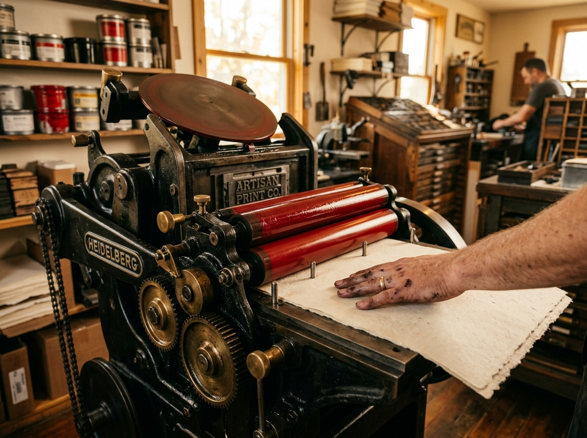
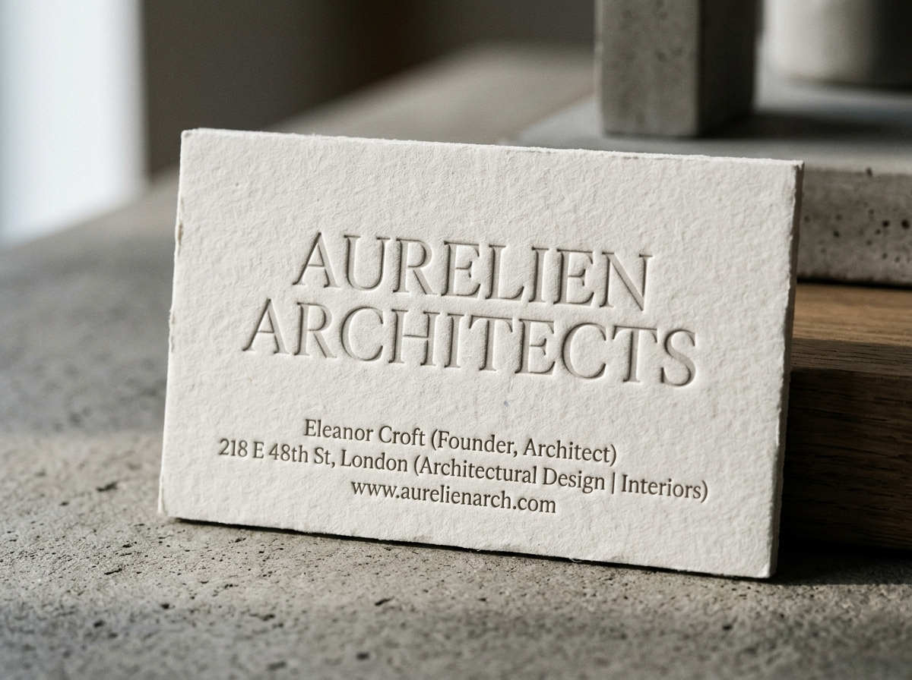
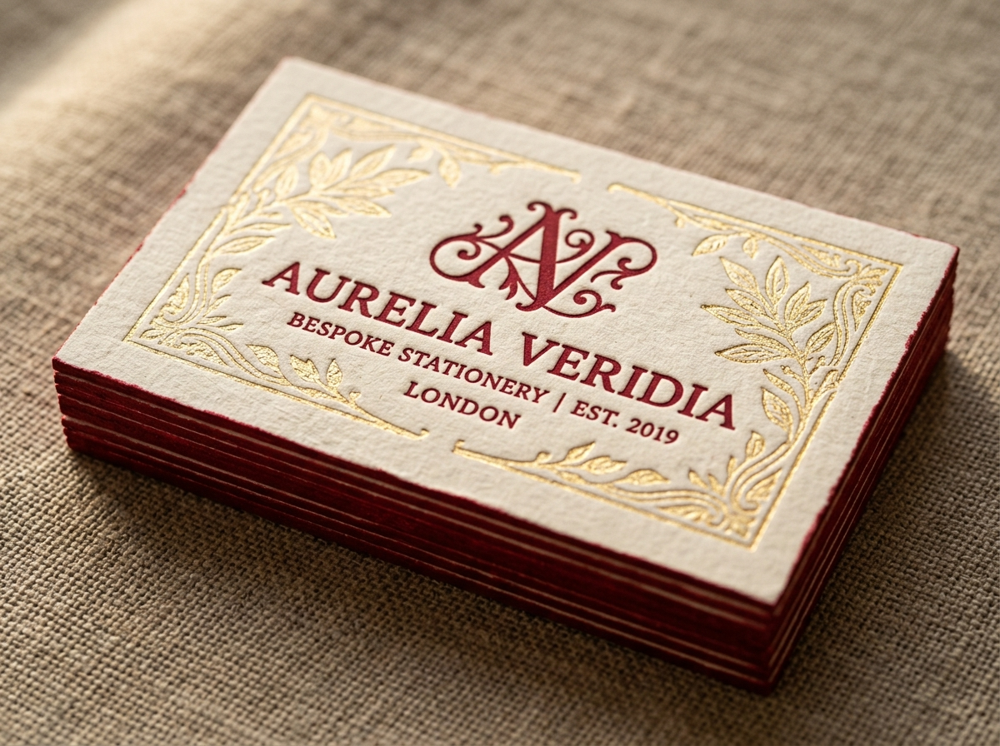
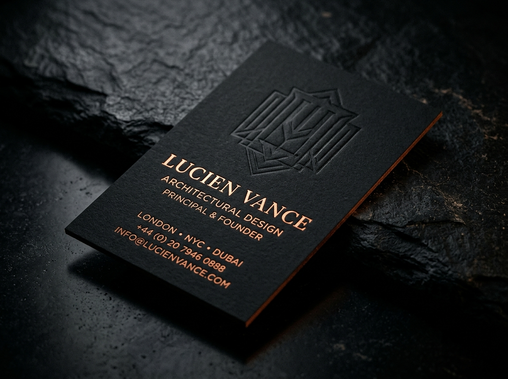

  

   
   

  # House of Press

  **Luxury Letterpress & Bespoke Design Studio**

  *In a hurry? Not the place for you.*

  

---

## ✦ The Studio

Welcome to **House of Press**, a sanctuary for the tangible. We specialize in bespoke, luxury letterpress printing and design, crafting experiences that are meant to be felt, not just seen.

We believe in the slow, meticulous art of printing. Every piece that leaves our studio is a testament to the timeless elegance of traditional craftsmanship, reimagined for modern brands.

  
  

## ✦ Our Craft

We don't just print; we sculpt paper. Our expertise lies in creating deep, tactile impressions on the finest materials available.

*   **600gsm Cotton Paper:** The foundation of our work. Thick, luxurious, and perfectly suited for deep impressions.
*   **Blind Deboss:** A subtle, sophisticated technique that creates depth and texture without ink.
*   **Gold Foil Stamping:** Adding a touch of timeless brilliance and unmistakable luxury.
*   **Brand Cards:** Elevating your brand identity with business cards that command attention.

  

## ✦ The Experience

Working with House of Press is an intentional process. We dedicate time, precision, and passion to every project.

> "In a hurry? Not the place for you."

This isn't a factory; it's a studio. We prioritize quality over speed, ensuring that every card, invitation, or brand piece is a masterpiece of tactile design.

## ✦ Aesthetics

Our design philosophy is rooted in **Premium Minimalism**. We believe in the power of negative space, elegant typography, and striking contrasts.

Our signature palette features:
*   **Brand Crimson:** `#A61C1D` - A deep, rich red signifying passion and heritage.
*   **Accent Gold:** `#D4AF37` - For touches of undeniable luxury.
*   **Linen & Obsidian:** A play on light and dark, creating perfect canvases for our impressions.

---

  <i>Crafted with precision. Pressed with passion.</i>

